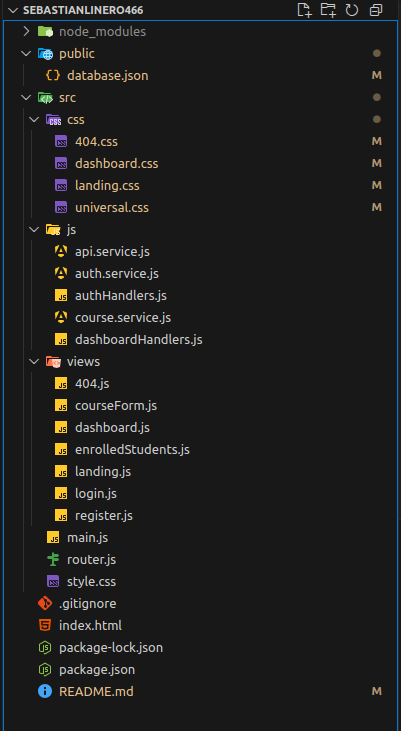

# Course Online Management
Welcome to Course Online Management! This is a Single Page Application (SPA) designed to manage online courses. It offers features like authentication, course administration, and an interactive dashboard with different user roles. It's built with Vanilla JavaScript, Vite for fast development, and json-server to simulate a RESTful API.

## 🚀 Key Features
 
- User Authentication: Allows users to register, log in, and log out securely.
- Course Management: Authorized users can create, view, update, and delete courses.
- Interactive Dashboard: Provides a centralized interface for user interaction, adapting to their roles (e.g., students, administrators).
- Role Management: Implements a role-based system to control access to different application functionalities.
- API Consumption: Communicates with a simulated backend (json-server) for data persistence.
🛠 Technologies Used
 
- Vite: A next-generation bundler for faster and lighter web development, optimizing the development experience.
json-server: A full fake REST API server with zero coding, ideal for rapid backend development and prototyping.
- Vanilla JavaScript: Application logic implemented with pure JavaScript.
- HTML5: Semantic content structure.
CSS3: Modern and responsive styles for the user interface.

## 📂 Project Structure




## ⚙️ Installation and Running

To get this project up and running, follow these steps:

### Prerequisites

Make sure you have [Node.js](https://nodejs.org/es/) and npm (Node Package Manager) installed on your system.

### Installing Dependencies

1. Clone this repository:
```bash
git clone <https://github.com/SlineroDC/sebastianlinero466.git>
cd course-online-management # Or the name of your folder
```
2. Install the project's dependencies (Vite, etc.):
```bash
npm install
```
3. Install `json-server` globally if you don't have it already:
```bash
npm install -g json-server
```
### Running the Project

1. **Start the API Server (json-server):**
Open a new terminal at the root of the project and run the following command to start the mock API server. This server will read data from `public/database.json`.
```bash
npx json-server --watch public/database.json --port 3000
```
(Make sure the API is running on the port your application expects; by default, it's set to `3000`.)

2. **Start the Application (Vite):**
In another terminal (without closing the `json-server` terminal), in the project root, run the following command to start the Vite development server:
```bash
npm run dev
```
Once the Vite server starts, it will usually automatically open in your default browser at `http://localhost:5173/` (or a similar port).

That's it! You should now have the application and API server up and running.

## 🚀 Usage

1) First become register your new user.
2) Login with email and password.
3) view dashboad and course.
4) enojoy.

## 📧Coder Information
- **Name:** Sebastián Andres Linero De Castro
- **Clan:** Caiman
- **Email:** sebastianlinero15@gmail.com
- **ID:** 1.193.266.467
- **Module:** 3 JavaScript Assambled

## Github and Repository
- **Name:** SlineroDC
- **Repository:** [Link to github](https://github.com/SlineroDC/sebastianlinero466.git)